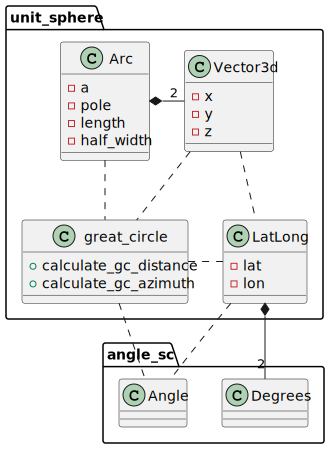

# unit-sphere

[](https://crates.io/crates/unit-sphere)
[](https://docs.rs/unit-sphere/)
[](https://opensource.org/license/mit/)
[](https://github.com/kenba/unit-sphere-rs/actions)
[](https://codecov.io/gh/kenba/unit-sphere-rs)

A library for performing geometric calculations on the surface of a sphere.

The library uses a combination of spherical trigonometry and vector geometry
to perform [great-circle navigation](https://en.wikipedia.org/wiki/Great-circle_navigation)
on the surface of a unit sphere, see *Figure 1*.

\
*Figure 1 A Great Circle Arc*

A [great circle](https://en.wikipedia.org/wiki/Great_circle) is the
shortest path between positions on the surface of a sphere.\
It is the spherical equivalent of a straight line in planar geometry.

## Spherical trigonometry

A great circle path between positions may be calculated using
[spherical trigonometry](https://en.wikipedia.org/wiki/Spherical_trigonometry).

The [course](https://en.wikipedia.org/wiki/Great-circle_navigation#Course)
(initial azimuth) of a great circle can be calculated from the
latitudes and longitudes of the start and end points.
While great circle distance can also be calculated from the latitudes and
longitudes of the start and end points using the
[haversine formula](https://en.wikipedia.org/wiki/Haversine_formula).
The resulting distance in `Radians` can be converted to the required units by multiplying the distance by the Earth radius measured in the required units.

## Vector geometry

Points on the surface of a sphere and great circle poles may be represented
by 3D [vectors](https://www.movable-type.co.uk/scripts/latlong-vectors.html).\
Many calculations are simpler and quicker using vectors than spherical trigonometry.

\
*Figure 2 Spherical Vector Coordinates*

For example, the across track distance of a point from a great circle can
be calculated from the [dot product](https://en.wikipedia.org/wiki/Dot_product)
of the point and the great circle pole vectors.
While the intersection points of great circles can simply be calculated from
the [cross product](https://en.wikipedia.org/wiki/Cross_product) of their
pole vectors.

## Design

The `great_circle` module performs spherical trigonometric calculations
and the `vector` module performs vector geometry calculations.
See: [spherical vector geometry](https://via-technology.aero/navigation/spherical-vector-geometry/).

The software uses types: `Angle`, `Degrees` and `Radians` from the
[angle-sc](https://crates.io/crates/angle-sc) crate.

\
*Figure 3 Class Diagram*

The library is declared [no_std](https://docs.rust-embedded.org/book/intro/no-std.html)
so it can be used in embedded applications.

## Example

The following example calculates the intersection between two Great Circle `Arc`s.
The values are taken from Charles Karney's original solution to
[Intersection between two geodesic lines](https://sourceforge.net/p/geographiclib/discussion/1026621/thread/21aaff9f/#fe0a).

```rust
use unit_sphere::{Arc, Degrees, LatLong, calculate_intersection_point};
use angle_sc::is_within_tolerance;

let istanbul = LatLong::new(Degrees(42.0), Degrees(29.0));
let washington = LatLong::new(Degrees(39.0), Degrees(-77.0));
let reyjavik = LatLong::new(Degrees(64.0), Degrees(-22.0));
let accra = LatLong::new(Degrees(6.0), Degrees(0.0));

let arc_0 = Arc::try_from((&istanbul, &washington)).unwrap();
let arc_1 = Arc::try_from((&reyjavik, &accra)).unwrap();

let intersection_point = calculate_intersection_point(&arc_0, &arc_1).unwrap();
let lat_long = LatLong::from(&intersection_point);
// Geodesic intersection latitude is 54.7170296089477
assert!(is_within_tolerance(54.72, lat_long.lat().0, 0.05));
// Geodesic intersection longitude is -14.56385574430775
assert!(is_within_tolerance(-14.56, lat_long.lon().0, 0.02));
```

## Contribution

If you want to contribute through code or documentation, the [Contributing](CONTRIBUTING.md) guide is the best place to start. If you have any questions, please feel free to ask.
Just please abide by our [Code of Conduct](CODE_OF_CONDUCT.md).

## License

`unit-sphere` is provided under a MIT license, see [LICENSE](LICENSE).
